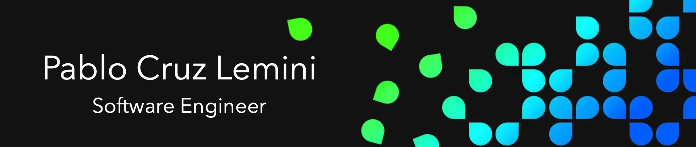

  
  
  
  

I'm a software engineer, living in Mexico City, with a background in finance. 

This is my [leetcode](https://leetcode.com/portfedh/) and my [codewars.](https://www.codewars.com/users/portfedh)

- 🔧 I’m currently working on:
    - An e-commerce website for a dance studio.
    - An access control system for the dance studio.
    - An admin and reporting system for the dance studio.
 
 - 📚 I’m also learning:
   - Data structure & algorithms
   - React Js
    
- Checkout my [website](https://pablocruz.io) for more information.
  
- 💬 Let's have a [coffeechat.](https://calendly.com/portfedh/cofee-chat)

- 📫 You can also reach me at: portfedh@gmail.com

## Technologies

### Front-End Development

    
    
      
    
    

      
### Back-End Development

    
    
  
  
  

### Frameworks, Libraries, Tools & Misc

    
    
    
    

<!-- html-end -->

<!-- Stats-start -->
## My Stats

 

<!-- Stats-end -->
